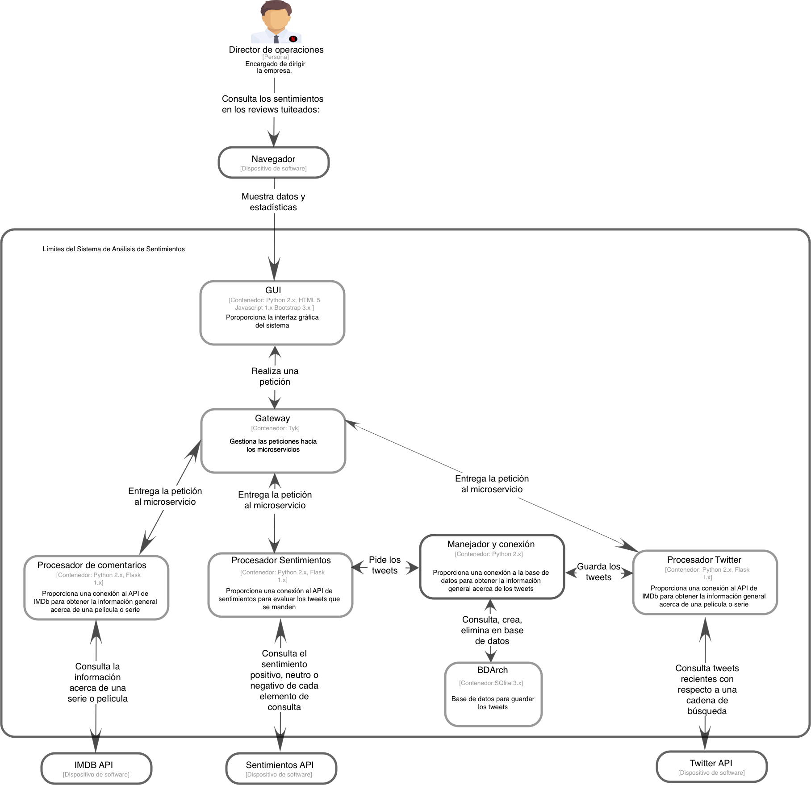

# Arquitectura-Micro-Servicios

## Repositorio de la tarea 2

## Sistema de Procesamiento de Comentarios

Antes de ejecutar el código asegurate de instalar los prerrequisitos del sistema ejecutando:
> sudo pip install -r requirements.txt  

Los paquetes que se instalarán son los siguientes:

Paquete        | Versión | Descripción
---------------|---------|------------
Flask          | 0.10.1  | Micro framework de desarrollo
requests       | 2.12.4  | API interna utilizada en Flask para trabajar con las peticiones hacia el servidor
python-twitter | 3.4.1   | Librería para consumir la API de twitter
sqlite | 3.9.0   | Base de datos en SQLite

*__Nota__: También puedes instalar éstos prerrequisitos manualmente ejecutando los siguientes comandos*   
> sudo pip install Flask==0.10.1  
> sudo pip install requests==2.12.4  
> sudo pip install python-twitter==3.4.1
> sudo pip install pysqlite

Una vez instalados los prerrequisitos es momento de ejcutar el sistema siguiendo los siguientes pasos:  
1. Ejecutar el servicio:  
   > python servicios/sv_information.py
2. Ejecutar el servicio de análisis de comentarios:  
   > python servicios/sv_sentiment.py
3. Ejecutar el servicio de twitter:
   > python servicios/sv_twitter.py
4. Ejecutar el GUI:
   > python gui.py  
5. Abrir el navegador
6. Acceder a la url del sistema:
   > http://localhost:8000/ - página de inicio!

## Versión

1.0.1 - Mayo 2018

## Autores

* **Alfredo Sánchez Martínez**
* **José Fernando González Herrera**
* **Luis Antonio Ibarra González**
* **Mario Alberto Negrete Rodríguez**

